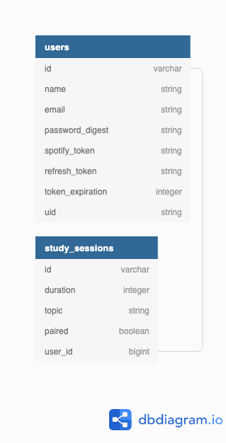

[](https://travis-ci.org/github/Maxwell-Baird/Jam_Session)

# Jam Sessions

This is the base repo for Jam Sessions, designed and built by Turing students.


### About the Project

This is a Ruby on Rails application used to provide a central hub for categorized, timed study sessions. Users can connect their Spotify account to have music access/control while using the application. Users are provided with a new quote for inspiration with every dashboard and study session visit. Users can see their previous study sessions topics and time durations, giving the ability to monitor time spent on topics or to quickly clone a similar session.


## Local Setup

Clone down the repo
```
$ git clone https://github/Maxwell-Baird/Jam_Session
```

Install the gem packages
```
$ bundle install
```

Set up the database
```
$ rails db:create
$ rails db:migrate
$ rails db:seed
```

### Project Schema


### API's

This project makes use of two API's, the Spotify API and the Daily Quote API.

### Spotify API

First, acquire a Spotify Client ID and Secret here:
- https://developer.spotify.com/documentation/general/guides/app-settings/#register-your-app

Once you have obtained an API key and enabled the API:

1. Run `bundle exec figaro install`
1. This will create the file `config/application.yml`. Open that file.
1. Append the following to that file: `SPOTIFY_CLIENT_ID_1: <your client_id>`, and on a new line, `SPOTIFY_CLIENT_SECRET_1: <your client_secret>`

### Daily Quote API


## Test Suite

You can run the test suite with:

```
$ bundle exec rspec
```

If set up correctly, and assuming you have internet access and both the Spotify and Daily Quote API is functioning correctly, you should have all passing tests.

## Technologies

* [Figaro](https://github.com/laserlemon/figaro)
* [OmniAuthSpotify](https://github.com/icoretech/omniauth-spotify)
* [BCrypt](https://github.com/codahale/bcrypt-ruby)

### Versions
* Ruby 2.5.3
* Rails 5.2.4.

### Creators
[DeMarcus Kirby](https://github.com/KirbyDD)
[Paul Debevec](https://github.com/PaulDebevec)
[Maxwell Baird](https://github.com/Maxwell-Baird)
[Colin Alexander](https://github.com/coloniusrex)
